# Treasure Box

A Minecraft-themed companion app for a real, physical treasure chest.

Tap the chest's NFC tag, scan its QR label, or type its code - the app opens
on a torch-lit cave, the camera settles on your chest, the lid swings open,
and the inventory chunk-loads in. Everything stored in the real box lives
here too: what it is, what it looks like, and exactly where it sits.

Works offline, no account, no network. One chest or many - storage bins,
toolboxes, moving boxes - each with its own tag, label, and look.

<p align="center">
  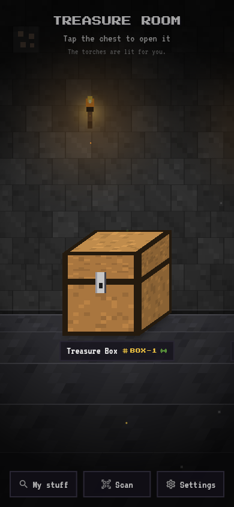
  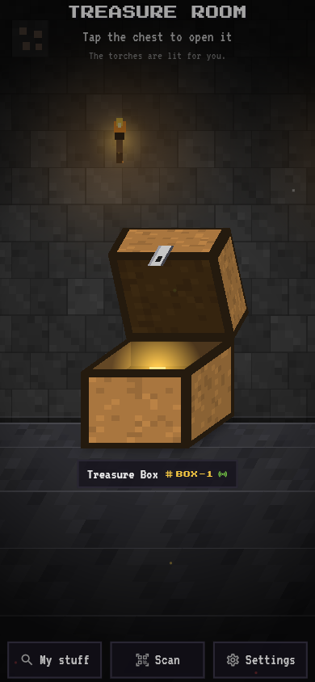
  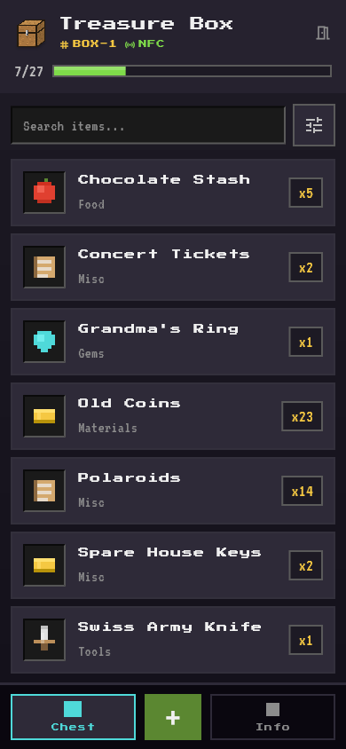
</p>

## The room

A panoramic cave diorama is the home screen. Torches are the light source,
ambient particles drift, and your chests stand on the ground - drag to look
around, tap a chest to open it. The wall hides mineable ores: tap them
Minecraft-style (harder ores take more hits) and a persistent points tally
grows in the corner. Coming back from a chest resumes exactly where you
were, and an NFC tap from anywhere - even outside the app - lands here and
plays the open animation.

## Open with a tap

Every box carries one human code (`BOX-1`, `BOX-2`, ...) reachable three ways:

| Rail | How | What's on it |
| --- | --- | --- |
| **NFC** | tap the phone on the tag | `treasurebox://box/BOX-N` URI + JSON metadata (NDEF) |
| **QR** | scan the printed label | `treasurebox://box/TB:BOX-N:QR` deep link |
| **Code** | type it, or the box name | plain `BOX-N` |

The app learns which rails a box actually uses and shows earned badges beside
its name. Codes are assigned lowest-free-slot, so deleting a box and creating
a new one reuses `BOX-1` - printed labels and written tags never go stale.
Tags are written from inside the app (Info -> Write tag), QR labels are
printable from the label kit.

## Inventory

<p align="center">
  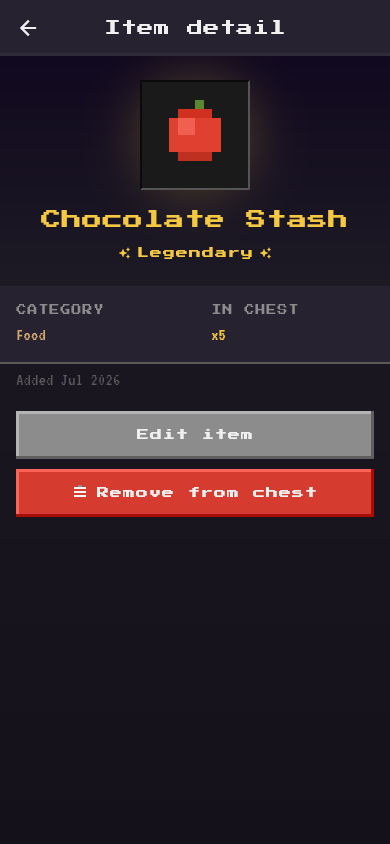
  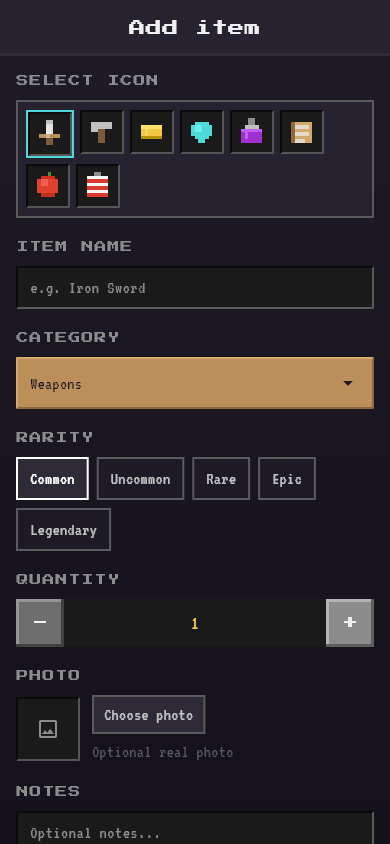
  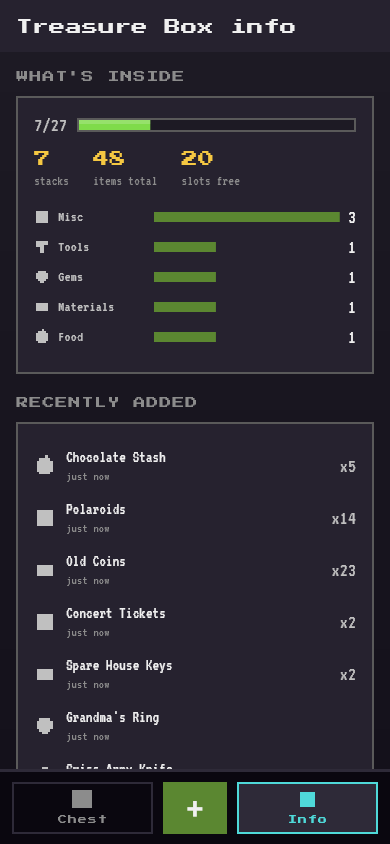
</p>

Items have a pixel icon or a real photo, a category, rarity, quantity,
notes, and a `spot` - where inside the box it rests ("side pocket", "bottom
layer"). Search, filter, and sort within a chest; capacity is tracked in
slots with a Minecraft-style fill bar. Rarity colors follow the game's
tooltip formatting - common white through epic light-purple, plus a gold
legendary tier.

Each chest's **Info** tab gathers everything about it: fill stats and
category breakdown, recent additions, name / chest type / capacity, the
label kit (printable QR + NFC writing), and the danger zone.

## Chests, plural

<p align="center">
  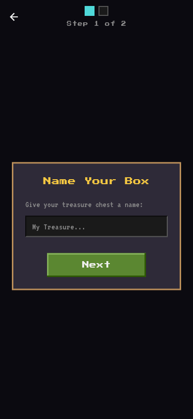
  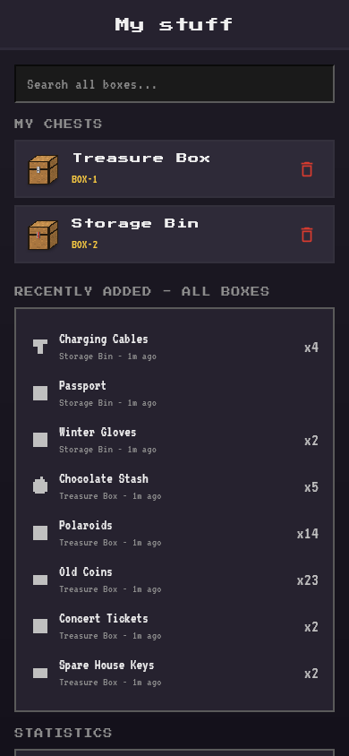
  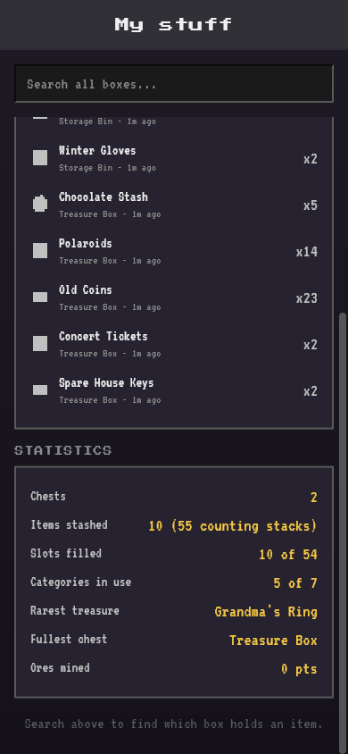
</p>

The create wizard names a chest and picks its type - the containers the
game actually has: **Chest**, **Large Chest**, **Trapped** (red-latched),
**Ender** (teal with the green eye), and the festive **Christmas** pair.

**My stuff** is the cross-box hub: search every chest at once ("which box
has my passport"), open or delete chests, see the latest additions
everywhere, and a statistics card in the spirit of the game's stats screen -
slots filled, categories in use, your rarest treasure crowned in its rarity
color, ores mined.

## Settings and the book

<p align="center">
  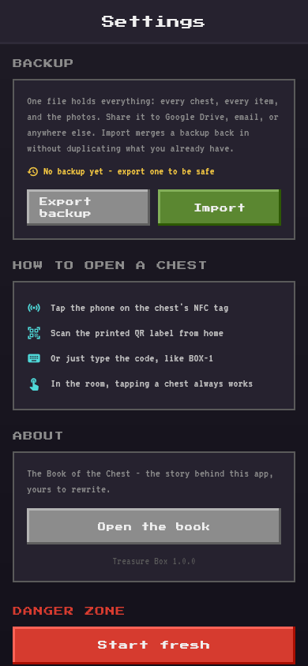
  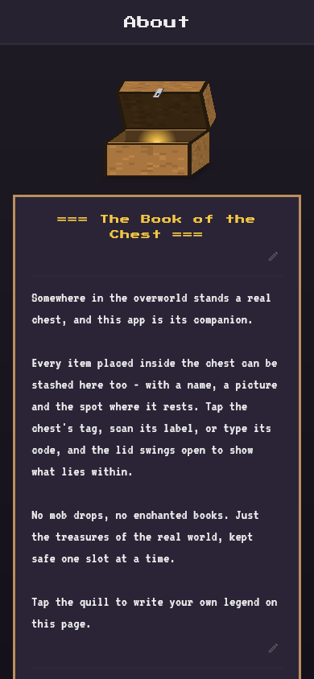
</p>

**Settings** holds the app-wide things: backup and restore, a short
how-to-open guide for whoever ends up holding the box, the About book, and
a start-fresh danger zone.

**Backup** is one file - a zip holding `backup.json` plus every item photo.
It goes to the system share sheet (Google Drive included, no cloud account
wiring), and import merges it back without duplicating anything: boxes match
by code, restored photos land in app storage, and re-importing the same
backup is harmless. The screen remembers when you last exported and nudges
until you have.

**The book** is an editable three-part lore page - header, body, footer -
each signed separately, like writing in a book and quill.

## The look

Everything is drawn in code - no image assets. The chests, the cave, the
torches, the pixel item icons, and the app icon itself are all
`CustomPainter` pixel art, crisp at any size. Type is Press Start 2P for
headings and VT323 for reading. The app runs fullscreen immersive, like the
game it tips its hat to.

## Getting started

```sh
flutter pub get
dart run build_runner build --delete-conflicting-outputs
flutter run -d chrome --dart-define=DEMO=true
```

`DEMO=true` seeds two chests with sample items. Without it the app starts
with one empty chest, ready for the real box.

NFC needs real hardware (Android/iOS). On desktop and web the app is fully
usable without it - taps can be simulated from Settings.

## Building a release (Android)

Release signing reads `android/key.properties` and the keystore it points to
(both untracked - generate your own):

```sh
keytool -genkeypair -keystore android/app/release.jks -alias yourkey \
  -keyalg RSA -keysize 2048 -validity 10000
```

```properties
# android/key.properties
storePassword=...
keyPassword=...
keyAlias=yourkey
storeFile=release.jks
```

```sh
flutter build apk --release --split-per-abi
# -> build/app/outputs/flutter-apk/app-arm64-v8a-release.apk
```

Without `key.properties` the build falls back to the debug key, so fresh
clones still build.

## Architecture

```text
UI (features/*)  ->  Riverpod providers  ->  InventoryRepository (interface)
                                                     |
                                          DriftInventoryRepository
                                                     |
                                            Drift (SQLite), offline
```

- Feature-first layout under `lib/features/`; shared primitives in
  `lib/core/`.
- Features depend on domain models only - generated Drift types never leave
  the data layer.
- `NfcService` is platform-abstracted: real `nfc_manager` sessions on mobile
  (self-healing across app pauses), a simulate-a-tap stub elsewhere.
- Deep links, NFC taps, and QR scans all resolve through one code parser and
  land in the room with the chest-open animation.
- Backups are pure codec functions over domain models, so the whole
  round-trip is unit-tested.

See [design.md](design.md) for the full design.

## Development

```sh
flutter analyze          # zero issues expected
flutter test             # unit + widget suites
```

The launcher icon is rendered from the in-app chest painter:

```sh
flutter test test/tools/render_icon_test.dart --run-skipped
flutter pub run flutter_launcher_icons
```

## License

[MIT](LICENSE). Not affiliated with Mojang or Microsoft; Minecraft is a
trademark of Mojang Synergies AB. This app contains no Minecraft assets -
all art is original pixel work.
